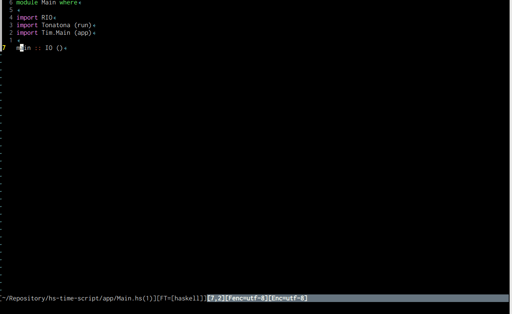
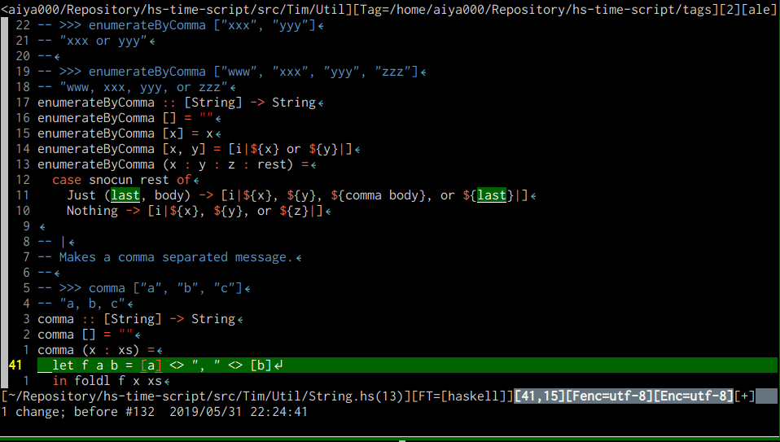
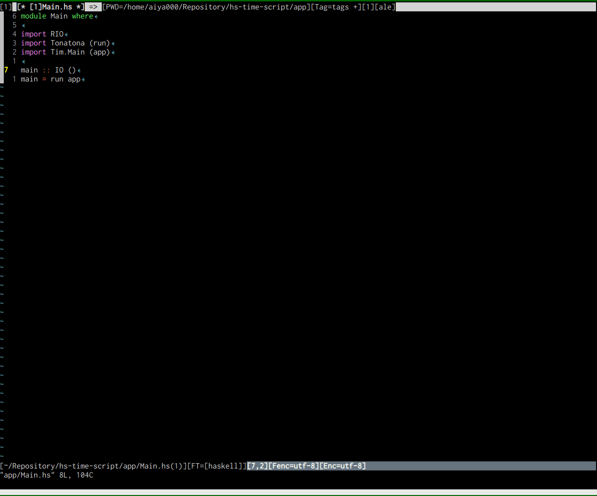

# :gift: vim-ghcid-quickfix :gift:

- - -

Increse your Haskell development via [ghcid](https://github.com/ndmitchell/ghcid)!

- - -

This allows to open ghcid as the quickfix buffer, by `:GhcidQuickfixStart`.

When you edited a .hs, it reloads automatically!



(quickfix_on_error)


(popup-always)


You can read compile errors/warnings by about 1sec.

## :grey_exclamation: Requirements :grey_exclamation:

- ghcid to your `$PATH`
- Vim 8.0 or later with `+terminal`

## :dizzy: How to install :dizzy:

### No package manager

clone this repo into `$MYVIMRC/pack/haskell/start/`

### dein.vim

```haskell
call dein#add('aiya000/vim-ghcid-quickfix')
```

### dein.vim with toml

```toml
[[plugins]]
repo = 'aiya000/vim-ghcid-quickfix'
```

## :grey_exclamation: Configuration :grey_exclamation:

Auto open QuickFix window upon errors:

```vim
let g:ghcid_quickfix = #{
  \ showing: 'quickfix_on_error',
\ }
```

Or 'popup_always' to popup all lines, using Vim's popup window.

```vim
let g:ghcid_quickfix = #{
  \ showing: 'popup_always',
\ }
```

Please see `:help g:ghcid_quickfix_showing` to more informations.
